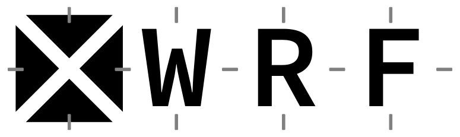
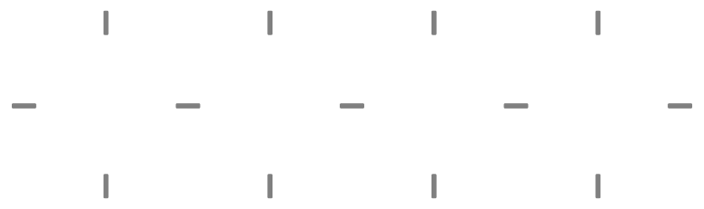

# Branding

`xWRF`'s minimalistic logo was inspired by destaggering and handling of WRF's C-grid, which are key features of `xWRF`. It was also generated _in Python_ using `matplotlib`, as shown below!

```python
from matplotlib.patches import BoxStyle, FancyBboxPatch, Polygon
import matplotlib.pyplot as plt
import numpy as np
%matplotlib inline
%config InlineBackend.figure_format='retina'
```

```python
# Options
gap_width = 0.135
color = {"bg_light": "k", "bg_dark": "w"}
tick_color = "grey"
tick_width = gap_width
tick_height = tick_width / 8
font_options = {
    "fontfamily": "Source Code Pro",
    "fontweight": "semibold",
    "fontsize": 200,
    "ha": "center",
    "va": "center_baseline"
}
letter_y_shift = 0.038
```

```python
def generate_xwrf_logo(ax, bg_type="bg_light"):
    """Create xwrf logo using provided Axes and specified color pattern."""
    # Define the "X" triangles
    gap_side = gap_width / np.sqrt(2)
    tri_left = np.array([
        [-0.5, 0.5 - gap_side],
        [-gap_side, 0],
        [-0.5, -0.5 + gap_side]
    ])
    tri_right = tri_left * np.array([[-1, 1]])
    tri_bottom = tri_left[:, ::-1]
    tri_top = tri_right[:, ::-1]
    for tri in (tri_left, tri_right, tri_top, tri_bottom):
        ax.add_patch(Polygon(tri, facecolor=color[bg_type], edgecolor=None))

    # Letters
    local_font_options = {**font_options, "c": color[bg_type]}
    for i, letter in enumerate("WRF", start=1):
        ax.text(i, letter_y_shift, letter, fontdict=local_font_options)

    # u ticks and v ticks
    for u_pos in np.arange(-0.5, 4, 1.):
        ax.add_patch(FancyBboxPatch(
            (-tick_width / 2 + u_pos, -tick_height),
            tick_width,
            tick_height,
            boxstyle=BoxStyle("Round", pad=tick_height/4),
            facecolor=tick_color,
            edgecolor=tick_color
        ))
    for v_pos in np.arange(0, 4, 1.):
        for y_offset in (-0.5, 0.5):
            ax.add_patch(FancyBboxPatch(
                (-tick_height / 2 + v_pos, -tick_width / 2 + y_offset),
                tick_height,
                tick_width,
                boxstyle=BoxStyle("Round", pad=tick_height/4),
                facecolor=tick_color,
                edgecolor=tick_color
            ))

    # Bounding
    ax.set_xlim(-0.6, 3.6)
    ax.set_ylim(-0.6, 0.6)
    ax.axis("off")
    ax.set_aspect("equal")
```

```python
# Generate static SVG files
for bg_type in color:
    fig, ax = plt.subplots(figsize=(16, 4))
    generate_xwrf_logo(ax, bg_type)
    fig.savefig(f"xwrf_logo_{bg_type}.svg", bbox_inches="tight", transparent=True)
```



